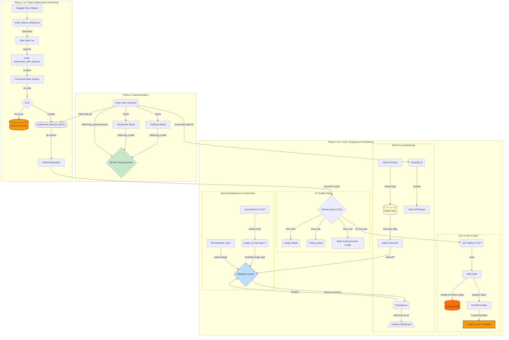

# End-to-End MLOps Pipeline for Real-Time Fraud Detection

[](https://github.com/amirulhazym/mlops-automated-pipeline/actions)

This repository documents the construction of a comprehensive, production-style MLOps pipeline. The project goes beyond simple model training and demonstrates a full-cycle approach to machine learning systems, encompassing scalable data engineering, multi-framework model experimentation, automated CI/CD, dual-target deployment (serverless and container orchestration), and a multi-faceted monitoring strategy.

The primary goal is to build a robust, reproducible, and automated system for a real-world fraud detection use case, leveraging a stack of industry-standard, open-source tools and cloud services, with a strong emphasis on professional engineering practices.

## Key Features

*   **Scalable Data Processing:** A configurable data pipeline built with **Apache Spark** to process a **6.3 million** row dataset, performing transformations and feature engineering.
*   **Comprehensive Version Control:** A unified versioning strategy using **Git** for code, **DVC** for large data artifacts (with AWS S3 as remote storage), and **MLflow** for experiment and model versioning.
*   **Multi-Model Experimentation:** A flexible training script that supports a "bake-off" between a classic **XGBoost** model and a **TensorFlow**-based neural network, with all results tracked in a central MLflow UI.
*   **Automated CI/CD Pipeline:** A robust Continuous Integration and Continuous Deployment pipeline built with **GitHub Actions**.
    *   **CI:** Automatically lints code with `flake8`, runs unit tests with `pytest`, and builds a versioned training Docker image.
    *   **CD:** Automatically deploys the inference API to **AWS Lambda** via **AWS SAM** using a secure OIDC connection.
*   **Dual-Target Deployment:** The same inference API is deployed to two distinct, modern cloud environments:
    1.  **Serverless:** AWS Lambda & API Gateway (via automated CD).
    2.  **Container Orchestration:** A local **Kubernetes** cluster managed by **Minikube**.
*   **Real-Time Architecture POC:** A Proof-of-Concept using **Apache Kafka** to simulate a real-time stream of transactions that are consumed and processed by the deployed API.
*   **Multi-Faceted Monitoring Stack:**
    *   **ML Quality Monitoring:** Using **Evidently AI** to generate data drift and model performance reports.
    *   **Application Performance Monitoring (APM):** A live monitoring stack using **Prometheus** for metrics collection and **Grafana** for real-time visualization of API latency and request rates.

## High-Level Architecture

This diagram illustrates the complete workflow of the MLOps pipeline, from data acquisition to monitoring.



## Technology Stack

| Category | Technologies Used |
|---|---|
| Data & ML | Python 3.11, Pandas, NumPy, Scikit-learn, Apache Spark (PySpark), XGBoost, TensorFlow (Keras) |
| MLOps & Automation | MLflow, DVC, GitHub Actions (CI/CD), AWS SAM, Pytest, Flake8 |
| Deployment & Cloud | Docker, Docker Compose, Kubernetes (Minikube), AWS S3, AWS Lambda, AWS API Gateway, AWS ECR, AWS IAM (OIDC) |
| Monitoring & Streaming | Apache Kafka, Prometheus, Grafana, Evidently AI |

## Project Structure

The repository is organized to separate concerns, making it clean and maintainable.

```
├── .github/workflows/          # Contains the GitHub Actions CI/CD pipeline (ci_pipeline.yml)
├── data/
│   ├── raw_data/               # Raw data generated by the acquisition script (.gitignore'd)
│   └── processed/              # Processed data from Spark (.gitignore'd), managed by DVC
├── docs/                       # Project documentation, including production considerations and reports
├── k8s/                        # Kubernetes manifest files (deployment.yaml, service.yaml, etc.)
├── mlruns/                     # Local MLflow experiment tracking data (.gitignore'd)
├── notebooks/                  # Jupyter notebooks for EDA and experimentation
├── scripts/                    # Helper and standalone scripts (data acquisition, monitoring report generation)
├── src/                        # Main application source code
│   ├── data_engineering/       # Spark preprocessing script
│   ├── p1_api_deployment/      # All source files for the P1 API deployment (SAM template, Dockerfile, etc.)
│   └── training/               # Model training script
├── .dockerignore               # Specifies files to exclude from Docker builds
├── .flake8                     # Configuration file for the flake8 linter
├── .gitignore                  # Specifies files for Git to ignore
├── docker-compose.yml          # Defines the local Kafka & Zookeeper services
├── requirements.txt            # Core application dependencies
└── requirements-dev.txt        # Development and testing dependencies
```

## Local Setup and Usage

Follow these steps to set up and run the project pipeline on a local machine (Windows with WSL/PowerShell focus).

### 1. Prerequisites

*   Git
*   Python 3.11
*   Docker Desktop
*   An AWS account with a configured IAM user and the AWS CLI
*   Minikube and kubectl (can be installed via winget)

### 2. Installation

Clone the repository:

```bash
git clone https://github.com/amirulhazym/mlops-automated-pipeline.git
cd mlops-automated-pipeline
```

Create and activate the Python virtual environment:

```bash
python -m venv p2env
.\p2env\Scripts\activate
```

Install all required dependencies:

```bash
pip install -r requirements.txt
pip install -r requirements-dev.txt
```

Configure Spark Environment (Windows Only):

*   Ensure JDK 11 or 17 is installed and JAVA_HOME is set.
*   Set up HADOOP_HOME with the required winutils.exe and hadoop.dll binaries.
*   Set the PYSPARK_PYTHON environment variable to point to the python.exe inside your p2env.

### 3. Running the Pipeline

The pipeline is designed to be run in logical stages.

**Acquire Data (Level 0):**

```bash
# For a small sample for development
python scripts/acquire_dataset.py --sample_size 1000000

# For the full dataset
python scripts/acquire_dataset.py
```

**Preprocess Data with Spark (Level 1):**

```bash
# Process the sample data
python src/data_engineering/preprocess_with_spark.py --input_file data/raw_data/sampled_fraud_data_1000000.csv --output_suffix sample_1M

# Process the full data
python src/data_engineering/preprocess_with_spark.py --input_file data/raw_data/full_fraud_data.csv --output_suffix full
```

**Version the Official Data with DVC (Level 1):**

```bash
# Authenticate with AWS first if needed
dvc add data/processed/engineered_features_full
git commit -m "Data: Version full processed dataset"
dvc push
```

**Train Models and Track with MLflow (Level 2):**

*   Start the MLflow UI in a separate terminal: `mlflow ui`
*   Run experiments from another terminal:

```bash
# Run XGBoost on the full dataset
python src/training/train_model.py --model_type xgboost --data_version full --run_name "XGBoost_Full_Data_v2"

# Run TensorFlow on the full dataset
python src/training/train_model.py --model_type tensorflow_mlp --data_version full --run_name "TF_MLP_Full_Data_v2"
```

**Deploy to Kubernetes (Level 5):**

*   Start the local cluster: `minikube start --profile mlops-cluster`
*   Build the API image: `docker build -t p1-fraud-api:final -f src/p1_api_deployment/Dockerfile src/p1_api_deployment/`
*   Load the image: `minikube image load p1-fraud-api:final --profile mlops-cluster`
*   Deploy the application: `kubectl apply -f k8s/`
*   Test the service: `minikube service p1-fraud-api-service --profile mlops-cluster`

## Key Learnings & Challenges

This project was a deep dive into the practical realities of building and debugging a modern MLOps system. The most valuable learnings came from solving a series of chained, real-world challenges:

*   **Complex Environment Configuration:** The initial setup of a local Spark environment on Windows was a significant challenge, requiring systematic debugging of JAVA_HOME paths, HADOOP_HOME and winutils.exe dependencies, Java/PySpark version incompatibilities, and Python worker pathing (PYSPARK_PYTHON). This experience provided a deep understanding of the entire dependency stack.
*   **CI/CD Deployment Failures:** The automated deployment pipeline (Level 4) failed for multiple reasons, each providing a critical lesson. I debugged and solved issues related to incorrect IAM permissions (missing ECR access), deprecated SAM CLI flags (`--no-confirm` vs. `--no-confirm-changeset`), and the intricate workflow of `sam build` vs. `sam deploy` for image-based packages. This iterative debugging loop is the core reality of professional DevOps.
*   **Kubernetes Deployment Cycle:** Deploying the API to Kubernetes (Level 5) was a multi-stage debugging process. I solved `ImagePullBackOff` errors by understanding the context separation between the host and Minikube Docker daemons. I then solved a `CrashLoopBackOff` with empty logs by re-engineering the Docker CMD instruction to be more robust, and finally stabilized the pod by implementing proper liveness and readiness probes to account for the model's load time.
*   **Storage Management:** I proactively identified and solved a critical low-storage issue on my C: drive by diagnosing that Docker Desktop's virtual disk was not shrinking. I successfully migrated Docker's entire WSL data root to a larger drive using `wsl --export/--import` commands, a non-trivial system administration task that ensured the long-term viability of my development environment.

## Future Enhancements & Production Roadmap

This project serves as a robust foundation. For a true production system, the next steps are outlined in detail in the **Production Considerations Document**. Key areas include:

*   Running data processing and training jobs on managed cloud services (like AWS EMR and SageMaker).
*   Implementing a centralized MLflow server.
*   Hardening the CI/CD pipeline with GitOps principles (ArgoCD/Flux).
*   Implementing advanced deployment strategies like canary releases.
*   Configuring proactive alerting in Grafana via Alertmanager.
