# End-to-End Automated MLOps Pipeline for Real-Time Fraud Detection 🏭

[](https://github.com/amirulhazym/mlops-automated-pipeline/actions)
[](https://www.python.org/downloads/release/python-3110/)
[](https://opensource.org/licenses/MIT)

## 📋 Project Overview

This repository documents the construction of a comprehensive, production-style MLOps pipeline. The project demonstrates a full-cycle approach to machine learning systems, encompassing scalable data engineering, multi-framework model experimentation, automated CI/CD, dual-target deployment (serverless and container orchestration), and a multi-faceted monitoring strategy.

The primary goal was to build a robust, reproducible, and automated system for a real-world fraud detection use case, leveraging a stack of industry-standard, open-source tools and cloud services, with a strong emphasis on professional engineering practices and a zero-cost mandate.

## 🏗️ System Architecture

This diagram illustrates the complete, multi-stage workflow of the MLOps pipeline, from local development to automated deployment and real-time monitoring.

```mermaid
graph TD
    subgraph "A. Local Development Environment 💻"
        direction LR
        subgraph "1. Data Engineering & Versioning"
            A[Hugging Face Dataset] --> B(script: acquire_dataset.py);
            B -- Generates --> C[Raw Data .csv];
            C --> D(script: preprocess_with_spark.py);
            D -- Creates --> E[Processed Data .parquet];
            E -- "dvc add" --> F{DVC};
            F -- "dvc push" --> G[("AWS S3 Remote")];
        end

        subgraph "2. Model Experimentation"
            H("script: train_model.py") -- Uses Data --> E;
            H -- Trains --> I1[XGBoost Model];
            H -- Trains --> I2[TensorFlow Model];
            I1 & I2 -- "mlflow.log_model()" --> J[("Local MLflow Server")];
            H -- "mlflow.log_params/metrics()" --> J;
        end

        subgraph "3. Source Code & Configuration"
            K1[Python Scripts <br> /src, /scripts];
            K2[DVC Metafile <br> .dvc];
            F -- Creates --> K2;
            K3[Dockerfiles];
            K4[Kubernetes Manifests <br> /k8s];
            K5[CI/CD Workflow <br> .github/workflows];
        end
    end

    A -- "git commit & push" --> L{GitHub Repository 🐙};

    subgraph "B. CI/CD Automation Pipeline (GitHub Actions) 🚀"
        L -- "Triggers on push to main" --> M{CI/CD Workflow};
        subgraph "CI: Quality Gates"
            M -- "Job 1" --> N1(Lint & Test);
            M -- "Job 2" --> N2(Build Training Docker Image);
        end
        subgraph "CD: Automated Deployment"
            M -- "Job 3 (needs CI)" --> O(Deploy P1 API to AWS);
        end
    end

    subgraph "C. Deployment Targets ☁️"
        subgraph "Serverless (Deployed by CD)"
            P[("AWS Lambda & API Gateway")];
        end
        subgraph "Container Orchestration (Deployed Manually)"
            Q{Kubernetes Cluster <br> Minikube};
            R[P1 API Docker Image] -- "minikube image load" --> Q;
            K4 -- "kubectl apply" --> Q;
        end
    end

    O -- "via AWS SAM" --> P;

    subgraph "D. Monitoring & Observability 📊"
        subgraph "Application Performance Monitoring (APM)"
            Q -- "Exposes /metrics" --> S(Prometheus);
            S -- "Data Source for" --> T[/Grafana Dashboard/];
        end
        subgraph "ML Model Quality Monitoring"
            U(Evidently AI Script) -- "Analyzes" --> E & J;
            U -- "Generates" --> V[Drift & Perf. Reports];
        end
        subgraph "Real-Time POC"
            W(Kafka Producer) -- "Sends Events" --> X[("Kafka Topic")];
            X -- "Streams to" --> Y(Kafka Consumer);
            Y -- "Calls API on" --> Q;
        end
    end

    %% Styling
    style G fill:#FF9900,stroke:#333,stroke-width:2px
    style J fill:#0E8752,stroke:#333,stroke-width:2px
    style L fill:#181717,color:#fff,stroke-width:2px,stroke:#555
    style P fill:#FF9900,stroke:#333,stroke-width:2px
    style Q fill:#326CE5,stroke:#333,stroke-width:2px,color:#fff
    style X fill:#231F20,stroke:#FFF,stroke-width:2px
    style T fill:#E6522C,color:#fff
```



## ⭐ Core Features

- **Scalable Data Processing**: A configurable Apache Spark pipeline processes a 6.3 million row dataset, performing feature engineering and transformations.
- **Comprehensive Version Control**: A unified strategy using Git for code, DVC for large data artifacts (with AWS S3 remote), and MLflow for experiment and model versioning.
- **Multi-Model Experimentation**: A flexible training script that supports a "bake-off" between XGBoost and a TensorFlow neural network, tracked in MLflow.
- **Automated CI/CD Pipeline**: A robust GitHub Actions pipeline that automatically lints (flake8), tests (pytest), builds Docker images, and deploys the inference API to AWS Lambda via AWS SAM and a secure OIDC connection.
- **Dual-Target Deployment**: The same inference API is deployed to two modern environments:
  - **Serverless**: AWS Lambda & API Gateway (via automated CD).
  - **Container Orchestration**: A local Kubernetes cluster managed by Minikube.
- **Real-Time Architecture POC**: A Proof-of-Concept using Apache Kafka to simulate a real-time stream of transactions processed by the deployed API.
- **Multi-Faceted Monitoring Stack**:
  - **ML Quality Monitoring**: Evidently AI generates data drift and model performance reports.
  - **Application Performance Monitoring (APM)**: A live stack using Prometheus for metrics collection and Grafana for real-time visualization of API latency and request rates.

## 🛠️ Technology Stack

| Category | Technologies Used |
|----------|------------------|
| Data & ML | Python 3.11, Pandas, Scikit-learn, Apache Spark (PySpark), XGBoost, TensorFlow |
| MLOps & Automation | MLflow, DVC, GitHub Actions (CI/CD), AWS SAM, Pytest, Flake8 |
| Deployment & Cloud | Docker, Docker Compose, Kubernetes (Minikube), AWS S3, AWS Lambda, AWS API Gateway, AWS ECR, IAM (OIDC) |
| Monitoring & Streaming | Apache Kafka (POC/Basics), Prometheus, Grafana, Evidently AI |

## 📁 Project Structure

```
mlops-automated-pipeline/
├── .github/workflows/          # GitHub Actions CI/CD pipeline (ci_pipeline.yml)
├── data/                       # Managed by scripts and DVC (.gitignore'd)
├── docs/                       # Project documentation and monitoring reports
├── k8s/                        # Kubernetes manifest files (deployment.yaml, service.yaml, etc.)
├── mlruns/                     # Local MLflow experiment data (.gitignore'd)
├── notebooks/                  # Jupyter notebooks for EDA and experimentation
├── scripts/                    # Helper scripts (data acquisition, monitoring)
├── src/                        # Main application source code
│   ├── data_engineering/       # Spark preprocessing script
│   ├── p1_api_deployment/      # Source files for the P1 API deployment (SAM template, Dockerfiles, etc.)
│   └── training/               # Model training script
├── .dockerignore
├── .flake8
├── .gitignore
├── docker-compose.yml          # Defines local Kafka & Zookeeper services
├── requirements.txt            # Core application dependencies
└── requirements-dev.txt        # Development and testing dependencies
```

## 🚀 Local Setup & Workflow

### Prerequisites

- Git, Python 3.11, Docker Desktop
- An AWS account with the AWS CLI and SAM CLI installed and configured.
- Minikube and kubectl (can be installed via winget).
- Correctly configured Java (JDK 17) and Hadoop (winutils.exe, etc.) environment variables for local Spark on Windows.

### Installation & Execution

**Clone & Install:**

```bash
git clone https://github.com/amirulhazym/mlops-automated-pipeline.git
cd mlops-automated-pipeline
python -m venv p2env
.\p2env\Scripts\activate
pip install -r requirements.txt
pip install -r requirements-dev.txt
```

**Run Pipeline Stages (Example Workflow):**

```bash
# 1. Acquire Data (creates sample and full datasets)
python scripts/acquire_dataset.py --sample_size 1000000

# 2. Preprocess the full dataset with Spark
python src/data_engineering/preprocess_with_spark.py --input_file data/raw_data/full_fraud_data.csv --output_suffix full

# 3. Version the official data with DVC
dvc add data/processed/engineered_features_full
# git commit and dvc push would follow

# 4. Train the champion model (start 'mlflow ui' in another terminal)
python src/training/train_model.py --model_type xgboost --data_version full --run_name "XGBoost_Champion_Run"

# 5. Deploy to Kubernetes (manual demonstration)
minikube start --profile mlops-cluster
# Build, load, and apply the P1 API manifests...
```

## 💡 Key Challenges & Learnings

This project was a deep dive into the practical realities of building and debugging a modern MLOps system. The most valuable learnings came from navigating the challenges that arise when integrating multiple complex systems, moving beyond simple script execution to true engineering. This section documents both the high-level strategic lessons and the specific technical hurdles that were overcome.

### Strategic Learnings: From Developer to MLOps Engineer

-   **Engineering for a Hybrid Workflow:** A key strategic decision was to design the entire pipeline to support both rapid local development and robust, official runs. By creating configurable data acquisition and processing scripts (`--sample_size`, `--output_suffix`), I could iterate quickly on a 1-million-row sample for debugging and testing, while reserving the full 6.3-million-row dataset for official model training. This professional workflow balances development speed with production-grade rigor.

-   **The CI/CD Feedback Loop as a Quality Gate:** I learned that a failing CI/CD pipeline is not a setback; it is the system working perfectly. The automated `flake8` checks and `pytest` runs in GitHub Actions acted as a critical quality gate, preventing buggy or non-compliant code from ever reaching the deployment stage. Experiencing the full loop—Push -> Fail -> Analyze Logs -> Fix -> Push -> Succeed—was a masterclass in the daily reality of a modern DevOps environment.

-   **Adapting Applications to Deployment Targets:** I learned that a "one-size-fits-all" approach to deployment is not always optimal. The AWS Lambda and Kubernetes environments have different constraints. This led to engineering two distinct versions of the API code: `api.py` with S3 download logic for Lambda's stateless, read-only nature, and a leaner `api_k8s.py` with a direct file load for the self-contained Kubernetes container. This demonstrates the critical skill of adapting application architecture to its target platform.

-   **Building a Multi-Layered Monitoring Strategy:** I learned that monitoring an ML system requires two distinct perspectives. I implemented a comprehensive strategy that included:
    1.  **Application Performance Monitoring (APM):** Using Prometheus and Grafana to track the operational health of the software (request rate, latency, errors). This is the "Ops" in MLOps.
    2.  **ML Quality Monitoring:** Using Evidently AI to track the health of the model and data (data drift, performance degradation). This is the "ML" in MLOps.
    A reliable system requires monitoring both the "body" (the API) and the "brain" (the model).

### Technical Problem-Solving Log

This log details the specific, hands-on technical challenges encountered and resolved during the project.

| Category | Specific Problem Encountered | Root Cause Analysis & Definitive Solution |
| :--- | :--- | :--- |
| **Spark Environment** | `FileNotFoundError: [WinError 2]` and `UnsatisfiedLinkError` on Windows. | **Cause:** PySpark on Windows requires the full set of Hadoop binaries for filesystem operations. `winutils.exe` alone is insufficient. <br> **Solution:** Created `HADOOP_HOME`, added it to the system `Path`, and populated it with the **complete `bin` directory** from a trusted Hadoop distribution, including `hadoop.dll`. |
| **Dependency Hell** | `UnsupportedClassVersionError` and `Cannot run program "python3"` errors. | **Cause:** A multi-part dependency conflict. `pyspark==4.0.0` required Java 17, while my system had Java 11. Subsequently, the Spark driver defaulted to looking for a `python3` executable. <br> **Solution:** 1. Pinned `pyspark==3.5.1` to match Java 11. 2. Set the `PYSPARK_PYTHON` environment variable to the absolute path of the `python.exe` inside my virtual environment. |
| **CI/CD Deployment** | `sam deploy` failed with `name unknown: The repository ... does not exist` in GitHub Actions. | **Cause:** A subtle IAM permission issue prevented the CI/CD role from creating the required ECR repository on-the-fly, even with broad permissions. <br> **Solution:** Adopted a more robust pattern by **pre-creating the ECR repository manually** in AWS. The CI/CD pipeline was then able to find the existing repository and successfully push the image. |
| **Kubernetes Deployment** | Pod was stuck in a `CrashLoopBackOff` state with empty logs from `kubectl logs`. | **Cause:** A low-level container startup failure, likely caused by shell/platform incompatibilities with the `Dockerfile`'s `CMD` instruction. <br> **Solution:** Re-engineered the `Dockerfile`'s `CMD` instruction to use the more robust **"exec form"**: `CMD ["python", "-m", "uvicorn", "api_k8s:app", ...]`, which calls the Python interpreter directly. |
| **Kubernetes Stability** | Pod would start, show `Running` for a few seconds, then crash and restart. | **Cause:** The application took several seconds to load the ML model. Kubernetes' default health checks were failing during this startup period, causing it to kill the "unhealthy" pod. <br> **Solution:** Implemented proper Kubernetes **liveness and readiness probes** in the `deployment.yaml`, using `initialDelaySeconds` to give the application adequate time to start before the first health check. |
| **Service Discovery** | Grafana could not find my API's metrics (`http_requests_total`). | **Cause:** Prometheus, installed via the Helm chart, uses a `ServiceMonitor` to discover targets, which relies on matching labels. My API's Kubernetes `Service` was missing the required `release: my-prometheus-stack` label. <br> **Solution:** Added the necessary label to the `service.yaml` manifest, which allowed the Prometheus Operator to correctly identify the service and configure the scraping job. |
| **System Storage** | `C:` drive storage was being consumed rapidly, threatening the development environment. | **Cause:** Docker Desktop's virtual disk file (`ext4.vhdx`) does not automatically shrink after pruning images. <br> **Solution:** Performed a low-level system administration task to **migrate Docker's entire WSL data root** from the system drive to a larger storage drive using `wsl --export` and `wsl --import` commands, permanently solving the issue. |

This project was a journey through the complete MLOps lifecycle. The challenges encountered were not setbacks, but invaluable opportunities to learn the practical, real-world skills of debugging complex environments, designing for reproducibility, and building resilient, automated, and observable machine learning systems.

## 🔮 Future Enhancements

The production-readiness of this system can be further enhanced. Key next steps are detailed in docs/production_considerations.md and include:

- Running data processing and training jobs on managed cloud services (e.g., AWS EMR, SageMaker).
- Implementing a centralized, cloud-hosted MLflow server.
- Hardening the CI/CD pipeline with GitOps principles (e.g., ArgoCD).
- Configuring proactive alerting in Grafana via Alertmanager.

## 👤 Author

**Amirulhazym**
- LinkedIn: linkedin.com/in/amirulhazym
- GitHub: github.com/amirulhazym
- Portfolio: amirulhazym.framer.ai
